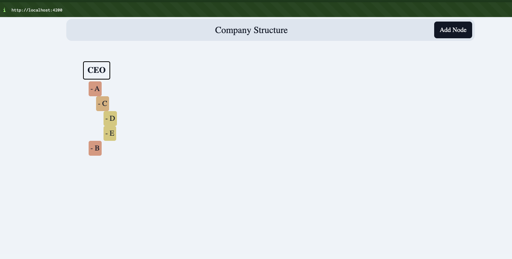
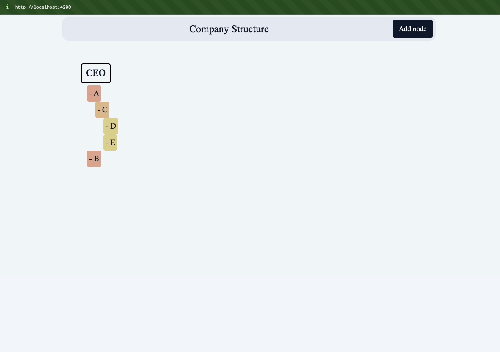

# Company

<!-- TODO: update -->

## How to run the project:

- Install dependencies (from root directory). Replace `pnpm` with your package manager.

```bash
$ pnpm install
```

- Run all services at once

```bash
$ pnpm dev
```

or each separately

- Run api

```bash
$ nx serve api
```

Api is served on port 3000: [localhost:3000/api/nodes/root/children](http://localhost:3000/api/nodes/root/children)

- Run frontend

```bash
$ nx serve frontend
```

open React app visiting: [localhost:4200](http://localhost:4200)

---

If setup went correct, when visiting localhost:4200 you should see



- Add new Node


